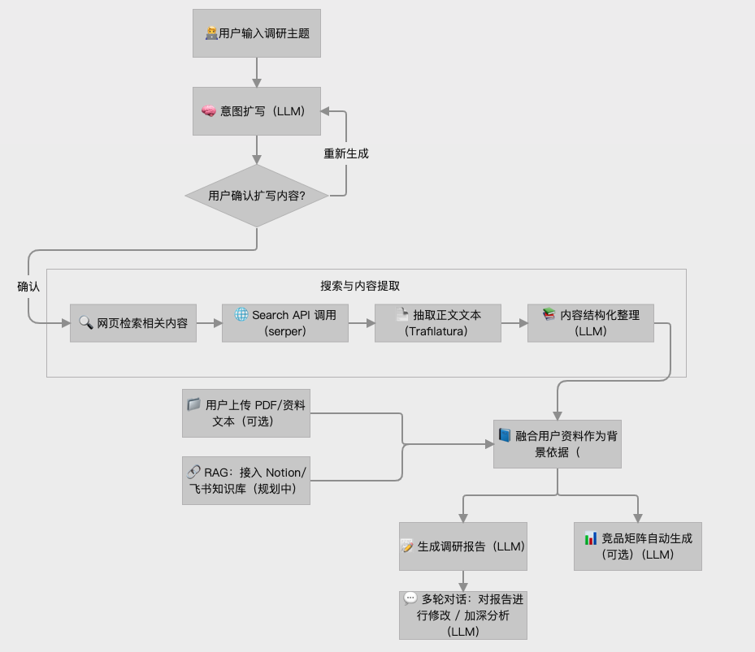
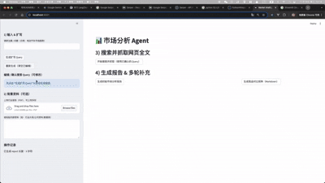

# AI市场调研助理Market Research Agent
一个基于 Streamlit + 大模型（如 Gemini / OpenAI 等） 实现的轻量级市场分析助手
通过「自动扩写 → 搜索 → 生成报告」的链式推理方式，实现全流程市场洞察生成。并且提供多种资料获取的方式，除了网页新闻搜索，你还可以提供PDF或连接你的notion/飞书（待做）。

## 🚀 项目背景&价值
传统市场调研耗时且碎片化，需要大量资料收集、结构化整理和报告撰写。本项目旨在构建一个具备：
* 自动理解需求
* 主动扩展调研方向
* 自动搜索最新相关资讯
* 输出结构化市场报告
* 支持多轮修改与补充
的Agent，帮助PM/创业者/分析师大幅度提升工作效率。

## 功能特性
1. 🧠 自动扩写意图：将你的简短调研需求扩写为更结构化的问题描述
2. 🔍 实时网络搜索：自动调用搜索接口抓取外部信息
3. 📄 生成结构化分析报告：包含 SWOT、竞争格局、潜在机会等
4. 💻 Streamlit UI：可直接部署到任何 Streamlit 环境或 cloud 平台

## 🧠 技术架构
* Streamlit：前端 UI
* Python + httpx：异步请求
* Gemini / OpenAI：LLM 主体
* Trafilatura：网页文本抽取
* Agent Workflow：扩写 → 搜索 → 报告


## 整体流程


## 动态演示GIF


## 如何本地运行
```
git clone https://github.com/Lainey0812/market-Research-Agent.git
cd market-Research-Agent
pip install -r requirements.txt
streamlit run app.py
```
环境变量
需要在`config.py`配置你的API
```
SERPER_API_KEY = "your serper_API_Key"
OPENAI_API_KEY = "your OpenAI_key"
```

## 项目结构
```
.
├── app.py                 # Streamlit 主程序
├── agents/
│   ├── writer.py          # 扩写 agent
│   ├── searcher.py        # 搜索 agent
│   ├── report_maker.py    # 报告生成 agent
│   └── utils.py           
├── assets/         # 截图
│   └── demo.gif           # 录屏 gif
├── requirements.txt
├── README.md
└── config.py
```

 ## 🔮 未来规划
 * RAG能力 （Notion/飞书知识库）
 * 自动生成PPT